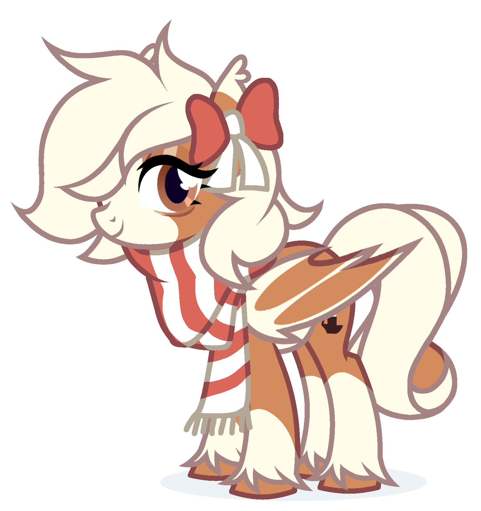

# 🦄 MinuetteBot

  
  
  **A unique Discord bot for pony catching, Equestrian economy, and exciting games!**
  
  
  
  

## Features

- **Pony Catching System** - Discover and collect unique ponies from the My Little Pony universe
- **Equestrian Economy** - Trade, earn bits, and manage your virtual wealth
- **Interactive Games** - Enjoy casino games, mini-games, and competitive challenges
- **Clan System** - Create or join clans with friends and compete together
- **Card Collection** - Collect, trade, and showcase rare pony cards
- **Customization** - Personalize your profile with backgrounds and skins
- **Regular Events** - Participate in seasonal events and special activities

## Quick Start

1. **Invite the bot** to your Discord server
2. **Use `/help`** to see all available commands
3. **Start catching ponies** with `/adventure` commands
4. **Build your collection** and join the fun!

## Why Minuette Bot?

Minuette Bot brings the magical world of Equestria to your Discord server with:

- **Unique gameplay** combining collection, strategy, and social interaction
- **Rich economy system** with multiple ways to earn and spend currency
- **Community features** that bring friends together
- **Regular updates** with new content and features
- **Intuitive commands** that are easy to learn and fun to master

## Technology

Built with modern technologies for optimal performance:
- **Discord.js v14** - Latest Discord API integration
- **Node.js** - High-performance JavaScript runtime
- **SQLite** - Reliable local database

## License

This project is licensed under the MIT License - see the [LICENSE](LICENSE) file for details.

---

  <i>Experience the magic of Equestria in Discord!</i>

